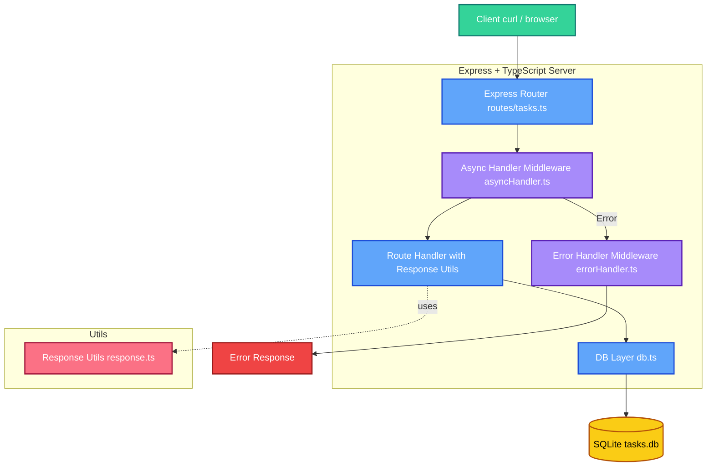

## ディレクトリ構成

```bash
practiece/
├── src/
│   ├── db.ts                    # SQLite接続＋テーブル初期化
│   ├── index.ts                 # メインサーバー
│   ├── middleware/
│   │   ├── asyncHandler.ts      # 非同期関数のエラーハンドリング
│   │   ├── cacheControl.ts      # キャッシュ制御ミドルウェア
│   │   └── errorHandler.ts      # エラーハンドリングミドルウェア
│   ├── routes/
│   │   └── tasks.ts             # CRUDルート
│   └── utils/
│       ├── httpError.ts         # HTTPエラークラス
│       ├── response.ts          # レスポンスユーティリティ
│       ├── task.ts              # タスクリソース変換
│       └── validators.ts        # バリデーション関数
├── tasks.db                     # SQLite DBファイル（.gitignore推奨）
├── package.json
├── tsconfig.json
└── .gitignore
```

---

````markdown
# Node.js + TypeScript + Express + SQLite CRUD API (Practice)

このプロジェクトは、Node.js と TypeScript を使用して構築した
**シンプルな CRUD API**（Create / Read / Update / Delete）です。

「ORM なしで、SQL を直接書いてデータを操作する」
という基本をアウトプットすることを目的にしています。

また、エラーハンドリングミドルウェアを実装し、
より実践的な API 開発のデモを行っています。

---

## 使用技術

- **TypeScript** – 型安全なバックエンド開発
- **Express** – シンプルな HTTP サーバーフレームワーク
- **SQLite** – 軽量で手軽な RDBMS
- **jq** – CLI で JSON 整形出力

---

## プロジェクト構成

```bash
src/
├── db.ts                    # DB初期化・接続設定
├── index.ts                 # サーバー起動・ルート登録
├── middleware/
│   ├── asyncHandler.ts      # 非同期関数のエラーハンドリング
│   ├── cacheControl.ts      # キャッシュ制御ミドルウェア
│   └── errorHandler.ts      # 共通エラーハンドリング
├── routes/
│   └── tasks.ts             # タスクCRUDエンドポイント
└── utils/
    ├── httpError.ts         # HTTPエラークラス
    ├── response.ts          # レスポンスユーティリティ
    ├── task.ts              # タスクリソース変換（HAL風リンク）
    └── validators.ts        # バリデーション関数
```
````

---

## セットアップ

### 1. 依存関係をインストール

```bash
npm install
```

### 2. 開発サーバーを起動

```bash
npm run dev
```

サーバーが立ち上がったら 👇
[http://localhost:3000/api/tasks](http://localhost:3000/api/tasks) へアクセス。

---

## API エンドポイント

| メソッド | パス             | 説明             |
| -------- | ---------------- | ---------------- |
| `GET`    | `/api/tasks`     | タスク一覧取得   |
| `GET`    | `/api/tasks/:id` | タスク詳細取得   |
| `POST`   | `/api/tasks`     | タスク追加       |
| `PUT`    | `/api/tasks/:id` | タスクの完全更新 |
| `PATCH`  | `/api/tasks/:id` | タスクの部分更新 |
| `DELETE` | `/api/tasks/:id` | タスク削除       |

---

## サンプルリクエスト

### GET: タスク一覧取得

```bash
curl http://localhost:3000/api/tasks | jq
```

**レスポンス例:**

```json
{
  "success": true,
  "data": [
    {
      "id": 1,
      "title": "Buy milk",
      "completed": false,
      "createdAt": "2024-01-01 12:00:00",
      "links": {
        "self": "/api/tasks/1"
      }
    }
  ]
}
```

### GET: タスク詳細取得

```bash
curl http://localhost:3000/api/tasks/1 | jq
```

**レスポンス例:**

```json
{
  "success": true,
  "data": {
    "id": 1,
    "title": "Buy milk",
    "completed": false,
    "createdAt": "2024-01-01 12:00:00",
    "links": {
      "self": "/api/tasks/1"
    }
  }
}
```

### POST: タスク追加

```bash
curl -X POST http://localhost:3000/api/tasks \
  -H "Content-Type: application/json" \
  -d '{"title": "Buy milk"}' | jq
```

**レスポンス例:**

- ステータスコード: `201 Created`
- ヘッダー: `Location: /api/tasks/1`

```json
{
  "success": true,
  "data": {
    "id": 1,
    "title": "Buy milk",
    "completed": false,
    "createdAt": "2024-01-01 12:00:00",
    "links": {
      "self": "/api/tasks/1"
    }
  }
}
```

### PUT: タスクの完全更新

```bash
curl -X PUT http://localhost:3000/api/tasks/1 \
  -H "Content-Type: application/json" \
  -d '{"title": "Updated title", "completed": true}' | jq
```

**注意:** `PUT`は完全更新のため、`title`と`completed`の両方が必須です。

**レスポンス例:**

```json
{
  "success": true,
  "data": {
    "id": 1,
    "title": "Updated title",
    "completed": true,
    "createdAt": "2024-01-01 12:00:00",
    "links": {
      "self": "/api/tasks/1"
    }
  }
}
```

### PATCH: タスクの部分更新

```bash
curl -X PATCH http://localhost:3000/api/tasks/1 \
  -H "Content-Type: application/json" \
  -d '{"title": "Updated title"}' | jq
```

**注意:** `PATCH`は部分更新のため、`title`と`completed`のいずれか（または両方）を指定できます。

**レスポンス例:**

```json
{
  "success": true,
  "data": {
    "id": 1,
    "title": "Updated title",
    "completed": false,
    "createdAt": "2024-01-01 12:00:00",
    "links": {
      "self": "/api/tasks/1"
    }
  }
}
```

### DELETE: タスク削除

```bash
curl -X DELETE http://localhost:3000/api/tasks/1
```

**レスポンス例:**

- ステータスコード: `204 No Content`
- ボディ: なし

### エラーレスポンス例

```json
{
  "success": false,
  "error": {
    "code": 404,
    "message": "Task not found",
    "details": null
  }
}
```

**よくあるエラー:**

- `400 Bad Request`: バリデーションエラー（例: `title`が必須、`id`が正の整数でない）
- `404 Not Found`: タスクが見つからない
- `500 Internal Server Error`: サーバー内部エラー

---

## アーキテクチャ図

```text
[ Client (curl, browser) ]
          │
          ▼
[ Express Router (tasks.ts) ]
          │
          ▼
[ Async Handler Middleware (asyncHandler.ts) ]
          │
          ▼
[ Response Utils (response.ts) ]
          │
          ▼
[ Error Handler Middleware (errorHandler.ts) ]
          │
          ▼
[ DB Layer (db.ts) → SQLite ]
          │
          ▼
     [ tasks.db file ]
```

---

## 🧱 アーキテクチャ図（Mermaid 版）



---

## 学習ポイント

- TypeScript × Express の基本構成を理解
- SQL を直接書くことで DB 操作の流れを把握
- ORM なしでも CRUD が書ける実践力を習得
- 非同期処理のエラーハンドリング（asyncHandler の実装）
- エラーハンドリングミドルウェアの実装
- 統一されたレスポンス形式の実装
- RESTful API の設計（GET, POST, PUT, PATCH, DELETE）
- HTTP ヘッダーの適切な使用（Location, Cache-Control）
- バリデーションとエラーハンドリングの一元管理
- HAL 風のリンクを含むリソース表現
- CLI (`curl`, `jq`) を使った API デバッグ

---

## 主な機能

### 非同期処理のエラーハンドリング（asyncHandler）

非同期関数のエラーハンドリングを簡素化するためのミドルウェアを実装しています。
`asyncHandler` を使用することで、各ルートハンドラーで try-catch を書く必要がなくなります。

```typescript
// middleware/asyncHandler.ts
export const asyncHandler =
  (fn: Function) => (req: Request, res: Response, next: NextFunction) =>
    Promise.resolve(fn(req, res, next)).catch(next);
```

### 統一されたレスポンス形式

成功時と失敗時のレスポンス形式を統一するユーティリティ関数を実装しています。

```typescript
// utils/response.ts
export const sendSuccess = <T>(
  res: Response,
  data: T,
  status = 200,
  meta?: Meta
) => {
  res.status(status).json({ success: true, data, meta });
};

export const sendError = (
  res: Response,
  status: number,
  message: string,
  details?: Meta
) => {
  res.status(status).json({
    success: false,
    error: { code: status, message, details },
  });
};
```

### HTTP エラークラス

HTTP ステータスコードとメッセージを一元管理するための`HttpError`クラスを実装しています。

```typescript
// utils/httpError.ts
export class HttpError extends Error {
  public readonly statusCode: number;
  public readonly details: Record<string, unknown> | undefined;

  constructor(
    statusCode: number,
    message: string,
    details?: Record<string, unknown>
  ) {
    super(message);
    this.statusCode = statusCode;
    this.details = details;
    this.name = "HttpError";
  }
}
```

### バリデーション

リクエストパラメータとボディのバリデーションを行う関数を実装しています。

```typescript
// utils/validators.ts
export function parseTaskId(idParam: string | undefined): number {
  const id = Number(idParam);
  if (!Number.isInteger(id) || id <= 0) {
    throw new HttpError(400, "Task id must be a positive integer");
  }
  return id;
}

export function requireTitle(raw: unknown): string {
  if (typeof raw !== "string") {
    throw new HttpError(400, "title must be a string");
  }
  const title = raw.trim();
  if (!title) {
    throw new HttpError(400, "title is required");
  }
  if (title.length > TITLE_MAX_LENGTH) {
    throw new HttpError(400, `title must be <= ${TITLE_MAX_LENGTH} characters`);
  }
  return title;
}
```

### エラーハンドリング

共通のエラーハンドリングミドルウェアを実装し、
すべてのルートで発生したエラーを一元管理しています。

```typescript
// middleware/errorHandler.ts
export const errorHandler: ErrorRequestHandler = (err, req, res, next) => {
  console.error("Error caught by middleware:", err);
  const status = (err as any).statusCode || 500;
  const message =
    status === 500 ? "Internal Server Error" : (err as any).message || "Error";
  res.status(status).json({ error: message });
};
```

### キャッシュ制御

`GET`リクエストには`Cache-Control: private, max-age=30`を設定し、
`POST/PUT/PATCH/DELETE`リクエストには`Cache-Control: no-store`を設定しています。

```typescript
// middleware/cacheControl.ts
export const declareNoCache: RequestHandler = (_req, res, next) => {
  res.setHeader("Cache-Control", "no-store, max-age=0");
  res.setHeader("Pragma", "no-cache");
  res.setHeader("Expires", "0");
  next();
};
```

### リソース表現（HAL 風リンク）

タスクリソースに`links.self`を含む HAL 風のリンクを実装しています。

```typescript
// utils/task.ts
export function toTaskResource(row: TaskRow): TaskResource {
  return {
    id: row.id,
    title: row.title,
    completed: Boolean(row.completed),
    createdAt: row.created_at,
    links: {
      self: `/api/tasks/${row.id}`,
    },
  };
}
```

### 完全更新（PUT）と部分更新（PATCH）

- **PUT**: `title`と`completed`の両方が必須で、完全更新を行います
- **PATCH**: `title`と`completed`のいずれか（または両方）を指定でき、部分更新を行います

### ルートハンドラーの実装例

```typescript
// routes/tasks.ts
router.post(
  "/",
  asyncHandler(async (req, res) => {
    const title = requireTitle(req.body.title);
    const completed = parseCompleted(req.body.completed) ?? false;

    const db = await getDB();
    const result = await db.run(
      "INSERT INTO tasks (title, completed) VALUES (?, ?)",
      title,
      booleanToSQLite(completed)
    );
    const newTask = await db.get(
      "SELECT * FROM tasks WHERE id = ?",
      result.lastID
    );
    if (!newTask) {
      throw new HttpError(500, "Failed to load created task");
    }
    const resource = toTaskResource(newTask);
    res.setHeader("Location", resource.links.self);
    sendSuccess(res, resource, 201);
  })
);
```

---

## 今後の拡張アイデア

- Zod によるリクエストバリデーション
- Prisma や Drizzle による ORM 化
- Docker 化して環境ごと管理
- GitHub Actions で自動テスト＆CI/CD
- JWT 認証によるユーザー認可機能
- ログ出力の改善（Winston や Pino の導入）

---

## Author

**Yuta Tokeshi (toke)**
フリーランスエンジニア / フロントエンド＋バックエンド開発者

> 学びながら"本質的な仕組み"を理解することを大切にしています。

---

## License

This project is licensed under the MIT License.

````

---

## `.gitignore` も追加しとこう！

```bash
node_modules
tasks.db
.env
dist
````

---

## RESTful ガイドラインへの対応

このプロジェクトは、RESTful API のベストプラクティスに従って実装されています。

### 統一されたインターフェース（Uniform Interface）

- **統一フォーマット**: すべてのレスポンスで `{ success: true/false, data: ..., error: ... }` という統一フォーマットを使用
- **Location ヘッダー**: `POST` リクエストで新規リソースを作成する際、`Location` ヘッダーに新規リソースの URI を設定（ステータスコード `201 Created`）
- **HAL 風リンク**: リソースに `links.self` を含む HAL 風のリンクを実装し、リソース間の関係を明確化

### ステートレス（Stateless）

- 各リクエストは独立しており、サーバー側でセッション状態を保持しない
- クライアントは必要な情報をすべてリクエストに含める

### キャッシュ可能（Cacheable）

- **GET リクエスト**: `Cache-Control: private, max-age=30` を設定し、30 秒間キャッシュ可能
- **POST/PUT/PATCH/DELETE リクエスト**: `Cache-Control: no-store, max-age=0` を設定し、キャッシュを無効化

### HTTP メソッドの適切な使用

- **GET**: リソースの取得（冪等）
- **POST**: 新規リソースの作成（非冪等）
- **PUT**: 完全更新（`title` と `completed` の両方が必須、冪等）
- **PATCH**: 部分更新（`title` と `completed` のいずれかまたは両方を指定、冪等）
- **DELETE**: リソースの削除（ステータスコード `204 No Content`、冪等）

### バリデーションとエラーハンドリング

- **ID バリデーション**: URI パラメータ `:id` は正の整数のみを受け付け（`parseTaskId`）
- **リクエストボディバリデーション**: `title` は文字列で必須、最大長 255 文字（`requireTitle`, `optionalTitle`）
- **型安全性**: `completed` は boolean 値のみを受け付け（`parseCompleted`）
- **エラーハンドリング**: `HttpError` クラスで HTTP ステータスコードとメッセージを一元管理

### REST Constraints の実装

- **Uniform Interface**: 統一されたレスポンス形式とリソース表現
- **Stateless**: サーバー側でセッション状態を保持しない
- **Cacheable**: 適切なキャッシュヘッダーの設定
- **Client-Server**: クライアントとサーバーの分離
- **Layered System**: ミドルウェアによる階層的な処理
- **Code on Demand**: 実装していない（オプショナル）

これらの実装により、RESTful API の原則を学習しやすい構成になっています。
