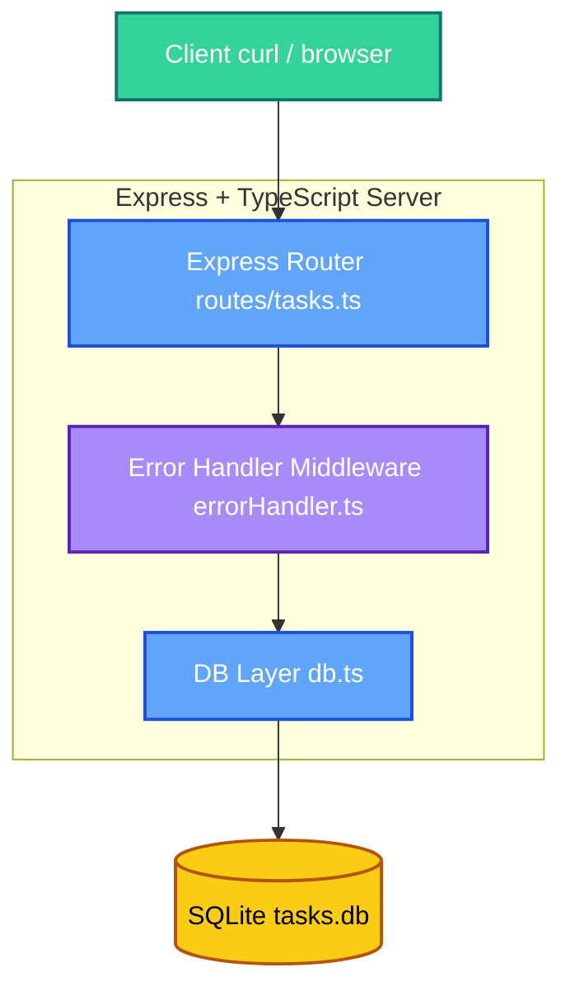

## ディレクトリ構成

```bash
practiece/
├── src/
│   ├── db.ts                    # SQLite接続＋テーブル初期化
│   ├── index.ts                 # メインサーバー
│   ├── middleware/
│   │   └── errorHandler.ts      # エラーハンドリングミドルウェア
│   └── routes/
│       └── tasks.ts             # CRUDルート
├── tasks.db                     # SQLite DBファイル（.gitignore推奨）
├── package.json
├── tsconfig.json
└── .gitignore
```

---

````markdown
# Node.js + TypeScript + Express + SQLite CRUD API (Practice)

このプロジェクトは、Node.js と TypeScript を使用して構築した
**シンプルな CRUD API**（Create / Read / Update / Delete）です。

「ORM なしで、SQL を直接書いてデータを操作する」
という基本をアウトプットすることを目的にしています。

また、エラーハンドリングミドルウェアを実装し、
より実践的な API 開発のデモを行っています。

---

## 使用技術

- **TypeScript** – 型安全なバックエンド開発
- **Express** – シンプルな HTTP サーバーフレームワーク
- **SQLite** – 軽量で手軽な RDBMS
- **jq** – CLI で JSON 整形出力

---

## プロジェクト構成

```bash
src/
├── db.ts                    # DB初期化・接続設定
├── index.ts                 # サーバー起動・ルート登録
├── middleware/
│   └── errorHandler.ts      # 共通エラーハンドリング
└── routes/
    └── tasks.ts             # タスクCRUDエンドポイント
```
````

---

## セットアップ

### 1. 依存関係をインストール

```bash
npm install
```

### 2. 開発サーバーを起動

```bash
npm run dev
```

サーバーが立ち上がったら 👇
[http://localhost:3000/api/tasks](http://localhost:3000/api/tasks) へアクセス。

---

## API エンドポイント

| メソッド | パス             | 説明                   |
| -------- | ---------------- | ---------------------- |
| `GET`    | `/api/tasks`     | タスク一覧取得         |
| `GET`    | `/api/tasks/:id` | タスク詳細取得         |
| `POST`   | `/api/tasks`     | タスク追加             |
| `PUT`    | `/api/tasks/:id` | タスクの完了状態を更新 |
| `PATCH`  | `/api/tasks/:id` | タスクの部分更新       |
| `DELETE` | `/api/tasks/:id` | タスク削除             |

---

## サンプルリクエスト

### GET: タスク一覧取得

```bash
curl http://localhost:3000/api/tasks | jq
```

### GET: タスク詳細取得

```bash
curl http://localhost:3000/api/tasks/1 | jq
```

### POST: タスク追加

```bash
curl -X POST http://localhost:3000/api/tasks \
  -H "Content-Type: application/json" \
  -d '{"title": "Buy milk"}' | jq
```

### PUT: 完了状態を更新

```bash
curl -X PUT http://localhost:3000/api/tasks/1 \
  -H "Content-Type: application/json" \
  -d '{"completed": true}' | jq
```

### PATCH: タスクの部分更新

```bash
curl -X PATCH http://localhost:3000/api/tasks/1 \
  -H "Content-Type: application/json" \
  -d '{"title": "Updated title", "completed": true}' | jq
```

### DELETE: タスク削除

```bash
curl -X DELETE http://localhost:3000/api/tasks/1 | jq
```

---

## アーキテクチャ図

```text
[ Client (curl, browser) ]
          │
          ▼
[ Express Router (tasks.ts) ]
          │
          ▼
[ Error Handler Middleware (errorHandler.ts) ]
          │
          ▼
[ DB Layer (db.ts) → SQLite ]
          │
          ▼
     [ tasks.db file ]
```

---

## 🧱 アーキテクチャ図（Mermaid 版）



---

## 学習ポイント

- TypeScript × Express の基本構成を理解
- SQL を直接書くことで DB 操作の流れを把握
- ORM なしでも CRUD が書ける実践力を習得
- エラーハンドリングミドルウェアの実装
- RESTful API の設計（GET, POST, PUT, PATCH, DELETE）
- CLI (`curl`, `jq`) を使った API デバッグ

---

## 主な機能

### エラーハンドリング

共通のエラーハンドリングミドルウェアを実装し、
すべてのルートで発生したエラーを一元管理しています。

```typescript
// middleware/errorHandler.ts
export const errorHandler: ErrorRequestHandler = (err, req, res, next) => {
  console.error("Error caught by middleware:", err);
  const status = (err as any).statusCode || 500;
  const message =
    status === 500 ? "Internal Server Error" : (err as any).message || "Error";
  res.status(status).json({ error: message });
};
```

### 部分更新（PATCH）

`PATCH /api/tasks/:id` エンドポイントでは、
リクエストボディで指定されたフィールドのみを更新します。
未指定のフィールドは既存の値が保持されます。

---

## 今後の拡張アイデア

- Zod によるリクエストバリデーション
- Prisma や Drizzle による ORM 化
- Docker 化して環境ごと管理
- GitHub Actions で自動テスト＆CI/CD
- JWT 認証によるユーザー認可機能
- ログ出力の改善（Winston や Pino の導入）

---

## Author

**Yuta Tokeshi (toke)**
フリーランスエンジニア / フロントエンド＋バックエンド開発者

> 学びながら"本質的な仕組み"を理解することを大切にしています。

---

## License

This project is licensed under the MIT License.

````

---

## `.gitignore` も追加しとこう！

```bash
node_modules
tasks.db
.env
dist
````

---
